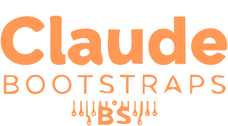

<p align="center">
  
</p>

<h1 align="center">Claude Bootstraps</h1>

<p align="center">
  Starter kits for two different Claude-powered workflows:<br/>
  <strong>high-volume batch processing</strong> and <strong>multiagent app development</strong>.
</p>

## Overview

This repository contains two independent bootstrap projects:

1. `batch-bootstrap/` — a Python pipeline for Anthropic Message Batches API jobs.
2. `multiagent-bootstrap/` — a Next.js + shadcn/ui template pre-configured for multiagent Claude Code workflows.

Both are designed to be copied and adapted into real projects.

## Repository Map

```text
.
├── batch-bootstrap/
│   ├── scripts/               # 5-step batch lifecycle tools
│   ├── examples/              # sample input JSONL + system prompt
│   ├── MANUAL.md              # usage and operational guidance
│   ├── SPEC.md                # formal API + pipeline specification
│   └── README.md
├── multiagent-bootstrap/
│   ├── .claude/               # agent definitions, commands, permissions, hooks
│   ├── app/                   # Next.js App Router scaffold
│   ├── components/            # UI component area
│   ├── lib/                   # shared utilities
│   ├── tests/                 # Vitest examples
│   ├── docs/SPEC.md           # architecture spec
│   ├── bootstrap.sh           # one-command project bootstrap
│   └── package.json
└── assets/
    └── claude-bootstrap-logo.svg
```

## Project 1: `batch-bootstrap`

Purpose: run large asynchronous Claude jobs with explicit, file-based state transitions.

### Highlights

- Validates input records and enforces batch limits (`100,000` requests, `256 MB` payload).
- Supports shared system prompts with optional prompt caching.
- Uses a deterministic lifecycle:
  - `01_prepare_batch.py`
  - `02_submit_batch.py`
  - `03_poll_status.py`
  - `04_fetch_results.py`
  - `05_cancel_batch.py` (optional branch)
- Produces flat `results.jsonl` output for downstream processing.

### Quick Start

```bash
cd batch-bootstrap
python -m venv .venv && source .venv/bin/activate
pip install anthropic
export ANTHROPIC_API_KEY="sk-ant-..."

python scripts/01_prepare_batch.py --input examples/input.jsonl --output batch_payload.json
python scripts/02_submit_batch.py --payload batch_payload.json
python scripts/03_poll_status.py
python scripts/04_fetch_results.py --output results.jsonl
```

## Project 2: `multiagent-bootstrap`

Purpose: scaffold a production-grade Next.js 15 workspace where Claude subagents have clear, role-based boundaries.

### Highlights

- Stack: Next.js 15, React 19, TypeScript strict mode, Tailwind v4, shadcn/ui.
- Tooling: Biome (`lint` + `format`), Vitest (unit), Playwright (E2E).
- Includes `.claude/` with:
  - Specialist agents (`orchestrator`, `platform-architect`, `integration-engineer`, `feature-implementer`, `reviewer`)
  - Slash commands (`/do`, `/architect`, `/integrate`, `/implement`, `/review`)
  - Safety hooks (blocks destructive shell commands)
- `bootstrap.sh` copies the scaffold into a target directory and runs first-time checks.

### Quick Start

```bash
cd multiagent-bootstrap
pnpm install
pnpm typecheck
pnpm lint
pnpm test
pnpm dev
```

To create a fresh project from this template:

```bash
cd multiagent-bootstrap
./bootstrap.sh my-new-app
```

## Notes From Codebase Analysis

- The two bootstraps are intentionally independent (no shared monorepo tooling at root).
- Documentation depth is strong: each project has a formal `SPEC.md` plus practical docs.
- The `multiagent-bootstrap/bootstrap.sh` success message references `/plan` and `/build`, while the actual command files are `/do`, `/architect`, `/integrate`, `/implement`, `/review`.

## Where To Go Next

1. Use `batch-bootstrap` if your priority is throughput and offline result collection.
2. Use `multiagent-bootstrap` if your priority is interactive app delivery with structured agent collaboration.
3. If useful, add a root `Makefile` next to this README to unify common setup/test commands across both projects.
